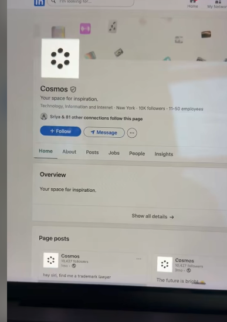

<div align="center">
  <h1>🌟 Glowkri - LinkedIn Glowing HDR Logo Generator</h1>
  <p><strong>The native macOS script to create ultra-bright, 10,000-nit "glowing" white logos for LinkedIn.</strong></p>
  
  [](#)
  [](#)
  [](#)
</div>

<p align="center">
  <br>
</p>

Have you seen those ridiculously bright, glowing logos on LinkedIn (like Oasis or Cosmos) that seem to jump off the screen on your iPhone or MacBook? They use a clever HDR (High Dynamic Range) trick to bypass standard compression and force Apple EDR (Extended Dynamic Range) displays to render pure white at maximum brightness.

**This open-source tool lets you do exactly that—in seconds, directly on your Mac.**

---

### ✨ Features
* **True 10,000 Nits:** Forces Apple EDR displays to maximum brightness.
* **Metadata Injector:** Bypasses LinkedIn's aggressive compression.
* **Native Swift Execution:** Zero dependencies (no ImageMagick or Python needed).
* **Instant:** Runs entirely locally on your Mac in milliseconds.

---

### 💻 System Support

| Operating System | Architecture | Supported |
| :--------------- | :----------- | :-------- |
| macOS            | Intel, Apple Silicon | ✅        |
| Linux            | x64, ARM64   | ❌        |
| Windows          | x64, ARM64   | ❌        |


## ✨ Why This Tool Exists (The Problem)

Standard image conversion tools (like ImageMagick or Photoshop) fail for LinkedIn uploads because:
1. They tone-map your 255 pure white pixels down to SDR (Standard Dynamic Range) white.
2. They inject EXIF metadata that triggers LinkedIn's aggressive privacy-scrubbing. This strips the HDR profile entirely during upload, leaving you with a dull, standard logo.

## 🚀 The Solution

This script bypasses those limitations. It executes native Swift `CoreGraphics` to:
1. Render your logo onto a true `255, 255, 255` white background.
2. Directly apply the `CGColorSpace.itur_2100_PQ` (Rec.2020 PQ) color space.
3. Export the JPEG with the **exact proprietary structural markers** that Apple's ColorSync and iOS expect to see. This allows the file to survive uploads and glow naturally on OLED iPhones and Liquid Retina XDR MacBooks.

---

## 🛠️ How to Use It

### ⭐ One-Line Auto-Run Download
To download, grant permission, and run the utility in one line:
```bash
curl -fsSL https://raw.githubusercontent.com/jemishavasoya/HDR_Logo/main/glowkri.sh -o glowkri.sh && chmod +x glowkri.sh && ./glowkri.sh my_logo.png
```

### 📝 Manual Step-by-Step

**Prerequisites:** You must run this on a Mac (macOS).

#### 1. Prepare Your Logo
Ensure your logo is a PNG with a transparent or white background. *(Pro tip: For the best glowing effect, use black or dark text/graphics).*

#### 2. Make the Script Executable
Open your terminal and run:
```bash
chmod +x glowkri.sh
```

#### 3. Generate the HDR Logo
Run the script, passing your logo as the argument:
```bash
./glowkri.sh my_logo.png
```

### 4. Get Your File
The script will instantly output a new file named `my_logo-hdr.jpg`. This is your new glowing logo!

---

## ⚠️ CRITICAL: How to Upload to LinkedIn

**Do NOT use AirDrop or the native iOS Image Picker to upload!**
The Apple iOS Image Picker is notorious for automatically converting non-standard HDR JPEGs to SDR before the LinkedIn app even receives the file. 

To ensure the HDR profile survives the upload process:
1. **Upload directly from your Mac** using your desktop web browser (Chrome, Safari, etc.).
2. *Note:* This trick is confirmed to work consistently for **Company Profiles**. Personal profiles often undergo heavy facial-recognition cropping and aggressive re-compression that destroys the HDR metadata.

---

## 📦 Included in this Repository
- `glowkri.sh`: The core generator script.
- `Jemish_Vasoya.png`: A sample starting logo to test.
- `Jemish_Vasoya-hdr.jpg`: The generated glowing HDR result.

## 🤩 Contribution
Found a way to make the HDR metadata stick on personal profiles? Want to port this to Windows/Linux using custom EXIF injection? Pull requests are highly welcome! 

## ☕ Support
You can also buy me a cup of coffee:
<a href="https://www.buymeacoffee.com/jempatellbv" target="_blank"></a>

## 📝 Credits & Inspiration
Inspired by the "ridiculously white" Oasis and Cosmos logos seen in the wild on LinkedIn, and based on native Swift `CGImageDestination` injection techniques to trick Apple's rendering engine.

---
**SEO Tags:** `LinkedIn Glowing Logo`, `HDR Logo LinkedIn`, `Apple EDR Display`, `Bright White Logo LinkedIn`, `OLED iPhone HDR Logo`, `LinkedIn Logo Hack`, `Rec.2020 PQ`, `10000 nits logo`, `HDR Image Generator`, `Bypass LinkedIn Compression`.
